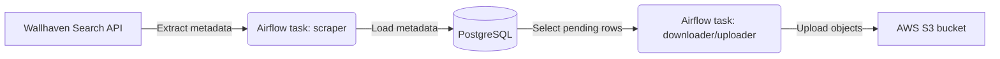

# draenei-collector


A small, portfolio ETL project that uses Apache Airflow to:
1) scrape wallpaper metadata from the Wallhaven API,
2) load metadata into Postgres for deduplication and tracking,
3) download images and upload them to an S3 bucket.

This is a learning project. It is not production-hardened.

## What The ETL Does



### Extract (Wallhaven -> Python)
- Source: `https://wallhaven.cc/api/v1/search`
- The scraper requests SFW results (`purity=100`) and sorts by `date_added` descending.
- It extracts a small set of fields per item (id/path/resolution/category/purity/file_size).
- Incremental logic: none. Each run chooses a random page in a small range and scrapes a bounded number of results.
- Failure mode: on request/API errors, the scraper returns an empty list and the downstream load task becomes a no-op.

### Load (Python -> Postgres)
- Destination table: `draenei_content.wallpapers`
- The loader inserts the extracted metadata into Postgres.
- Idempotency:
  - Inserts use `ON CONFLICT (wallhaven_id) DO NOTHING`, so reruns do not duplicate metadata.
- Assumptions:
  - A unique constraint exists on `wallhaven_id`.
  - The table contains at least the columns referenced by the code: `wallhaven_id`, `url`, `resolution`, `category`, `purity`, `file_size`.

### Download + Upload (Postgres -> S3, then Postgres update)
- Source: rows from `draenei_content.wallpapers` where `s3_key IS NULL`, limited to a small batch per run.
- Transform:
  - Downloads the image URL into memory.
  - Derives an S3 key as `wallpapers/{wallhaven_id}.{ext}` (with a default extension fallback).
- Destination:
  - Uploads the bytes to S3 using `put_object`.
  - Updates Postgres with the `s3_key` and `updated_at` for each successfully uploaded row.
- Idempotency:
  - Rows with a non-null `s3_key` are skipped, so reruns are safe for already-uploaded items.
- Failure modes:
  - Download errors and S3 errors are handled per-row; the task continues to the next item.

## Repository Layout
- `dags/draenei_etl_dag.py`: Airflow DAG wiring and scheduling.
- `plugins/collector/`: scraping and database load tasks.
- `plugins/uploader/`: S3 upload helpers and the download/upload task.

## Running Locally (Docker Compose)

### Prerequisites
- Docker and Docker Compose
- An S3 bucket you control
- AWS credentials with least-privilege access to that bucket

### Environment Variables
Create a `.env` file in the repository root (do not commit it):
```ini
AWS_ACCESS_KEY_ID=...
AWS_SECRET_ACCESS_KEY=...
AWS_DEFAULT_REGION=us-east-1
BUCKET_NAME=your-bucket-name
```

Notes:
- The code loads environment variables via `python-dotenv` and standard process environment.
- Do not use long-lived admin keys. Prefer a dedicated IAM user/role scoped to a single bucket/prefix.

### Start Services
```bash
docker-compose up -d
```

### Access
- Airflow UI: `http://localhost:8080` (user: `admin`, password: `admin`)
- Postgres: `localhost:5435` (user: `airflow`, password: `airflow`)

## Security Notes
- Credentials are not hard-coded. They are read from environment variables.
- Treat `.env` as sensitive and keep it out of version control.
- Use least-privilege AWS permissions:
  - Restrict access to the target bucket and (ideally) a prefix like `wallpapers/`.
  - Disable public bucket access unless you explicitly intend it.
- Avoid logging secrets. This project prints status messages only; it does not print AWS keys.

## Operational Notes And Limitations
- This pipeline uses small batch limits to keep each run bounded.
- It uses `print(...)` rather than structured logging.
- There is no migration tool in this repository; the Postgres schema/table must exist with the columns used by the tasks.
