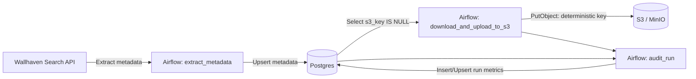

# draenei-collector

An end-to-end, beginner-friendly data ingestion pipeline (Airflow + Postgres + S3) that scrapes wallpaper metadata from Wallhaven, deduplicates/upserts it into Postgres, downloads the actual images, uploads them to an S3 bucket, and writes a per-run audit record with basic data-quality / run metrics.

## Architecture



## Quickstart (One Command)

Prereqs: Docker + Docker Compose

```bash
docker compose up --build
```

What you get locally:
- Airflow UI on `http://localhost:8080` (user: `admin`, password: `admin`)
- Postgres on `localhost:5435` (user: `airflow`, password: `airflow`, db: `airflow`)
- Local S3-compatible object storage (MinIO):
  - API: `http://localhost:9000`
  - Console: `http://localhost:9001` (user/pass are from `AWS_ACCESS_KEY_ID` / `AWS_SECRET_ACCESS_KEY`, default `minioadmin` / `minioadmin`(for local demo only!))

Notes:
- Postgres schema bootstrap runs automatically on first start via `sql/001_create_tables.sql`.
- If you want a clean reset (re-run SQL init scripts), use:
  ```bash
  docker compose down -v
  docker compose up --build
  ```

## Environment Variables

Copy `.env.example` to `.env` to override defaults (no secrets are committed).

Variables:
- `BUCKET_NAME`: bucket to write images to
- `AWS_ACCESS_KEY_ID`, `AWS_SECRET_ACCESS_KEY`, `AWS_DEFAULT_REGION`: used by `boto3`
- `S3_ENDPOINT_URL`: if set, `boto3` uses this endpoint (default points to local MinIO)
- `S3_FORCE_PATH_STYLE`: set `true` for MinIO compatibility
- `UPLOAD_BATCH_LIMIT`: max images uploaded per DAG run

To use real AWS S3:
- Set `S3_ENDPOINT_URL=` (empty / unset)
- Set `AWS_ACCESS_KEY_ID`, `AWS_SECRET_ACCESS_KEY`, `AWS_DEFAULT_REGION`, `BUCKET_NAME` to your real AWS values

## How To Verify Success

### 1) Trigger a DAG run
1. Open Airflow: `http://localhost:8080` (admin/admin)
2. Find DAG `draenei_content_loader_v4_clean`
3. Trigger it (or wait for the `@daily` schedule)

### 2) Check Postgres rows
Connect:
```bash
docker compose exec postgres psql -U airflow -d airflow
```

Run:
```sql
-- metadata is upserted/deduped by wallhaven_id
SELECT COUNT(*) FROM draenei_content.wallpapers;

-- images still pending upload
SELECT COUNT(*) FROM draenei_content.wallpapers WHERE s3_key IS NULL;

-- run-level audit record (one row per Airflow run)
SELECT
  dag_id,
  run_id,
  metadata_inserted,
  metadata_updated,
  images_uploaded,
  download_failures,
  upload_failures,
  missing_s3_after_run,
  duration_seconds,
  ended_at
FROM draenei_content.run_audit
ORDER BY ended_at DESC
LIMIT 5;
```

### 3) Check objects in S3 (MinIO)
Option A: MinIO console `http://localhost:9001` and browse bucket `BUCKET_NAME` (default `draenei-collector`).

Option B: Use `mc` in the `minio-init` container:
```bash
docker compose run --rm minio-init mc ls local/$BUCKET_NAME
```

## Data Engineering Notes (Idempotency, Quality, Observability)

### Idempotency
- Postgres upsert: `draenei_content.wallpapers` is keyed by `wallhaven_id` (unique index), and loads use `ON CONFLICT ... DO UPDATE`.
- S3 keys are deterministic: `wallpapers/{wallhaven_id}.{ext}`.
  - If the object already exists at that key, the upload task treats it as success and updates Postgres.

### Basic Data Quality Checks
- Loader drops invalid items missing `wallhaven_id` or `url` and reports `invalid` count in logs and XCom.
- Audit task records `missing_s3_after_run` so you can quickly see backlog.

### Minimal Observability
- Each task logs a concise summary with a `[draenei]` prefix.
- `audit_run` writes one row per Airflow run into `draenei_content.run_audit`.

## Troubleshooting

- Airflow UI login:
  - Default is `admin` / `admin` (created by the `airflow-init` service).
- "Tables do not exist" in Postgres:
  - The init scripts only run on the first time the Postgres volume is created.
  - Reset with `docker compose down -v` and restart.
- S3/MinIO permission errors:
  - Make sure `BUCKET_NAME` matches what MinIO created.
  - For AWS S3, ensure IAM permissions allow `s3:PutObject`, `s3:GetObject`, and optionally `s3:HeadObject` for the bucket/prefix.
- Wallhaven API rate limiting / transient errors:
  - The scraper uses basic retries/backoff; runs may still return 0 items if the API is unavailable.

## Future Improvements (Intentional Next Steps)

- dbt models for curated tables + tests (unique/not_null) on top of the raw ingestion table
- Store images in a curated zone (parquet + manifest) and version metadata
- Add CI (lint + unit tests + docker compose smoke test)
- Add a small "dead-letter" table for persistent failures and reprocessing tooling
