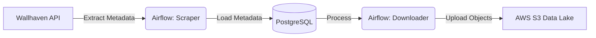

# draenei-collector

# 🔮 Draenei Art Collector: ETL Pipeline


Automated Data Pipeline for collecting, processing, and storing digital art from the World of Warcraft universe. The project demonstrates building a Data Lake based on AWS S3 using Apache Airflow for orchestration.

---

## 🏗 Архітектура

Data Flow побудований за принципом **ELT (Extract, Load, Transform)**:


1. Extract: Python scraper collects image metadata (ID, tags, size) via REST API.

2. Load (Staging): Metadata is stored in PostgreSQL for deduplication (Idempotency check).

3. Transform & Upload:
- Check for file existence in S3.

- Upload image to container memory.

- Upload to AWS S3 with status update in database.

🛠 Technology stack
- Language: Python 3.9+

- Orchestration: Apache Airflow 2.9 (Running in Docker)

- Database: PostgreSQL 13

- Cloud: AWS S3 (boto3 SDK)

- Infrastructure: Docker Compose

## 🚀 How to launch the project
### 1. Cloning the repository
```
Bash

git clone [https://github.com/YOUR_USERNAME/draenei-collector.git](https://github.com/YOUR_USERNAME/draenei-collector.git)
cd draenei-collector
```
### 2. Setting environment variables
Create a .env file in the root of the project:
```
Ini, TOML

AWS_ACCESS_KEY_ID=your_access_key

AWS_SECRET_ACCESS_KEY=your_secret_key

AWS_DEFAULT_REGION=us-east-1
BUCKET_NAME=your-unique-bucket-name
```
### 3. Launch infrastructure
```
Bash

docker-compose up -d
```
### 4. Access to interfaces
- Airflow UI: http://localhost:8080 (login: admin, password: admin)

- Database: localhost:5435 (user: airflow, pass: airflow)


### 💡 Implementation features (Highlights)
Idempotency: The pipeline can be restarted many times - duplicates are not created thanks to ON CONFLICT DO NOTHING and checking s3_key IS NULL.

Clean Code: The logic is moved from the DAG file to separate modules (plugins/collector, plugins/uploader).

Security: Credentials are not stored in the code, but are taken from .env.